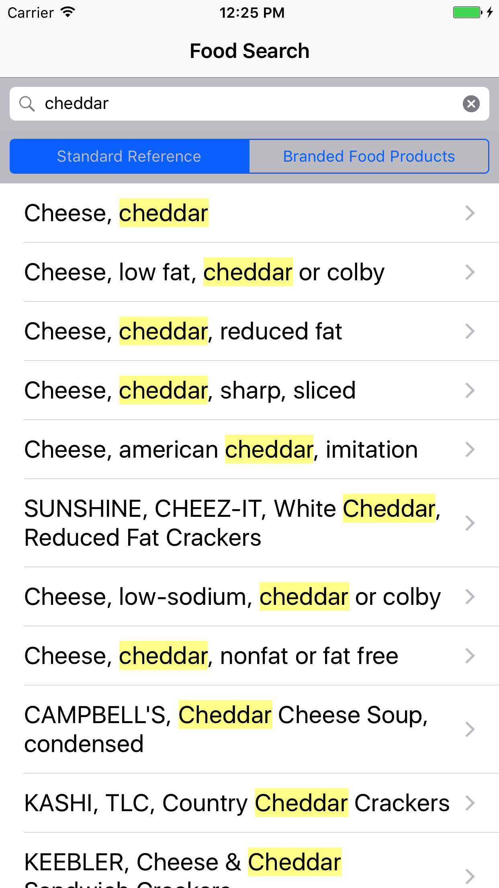
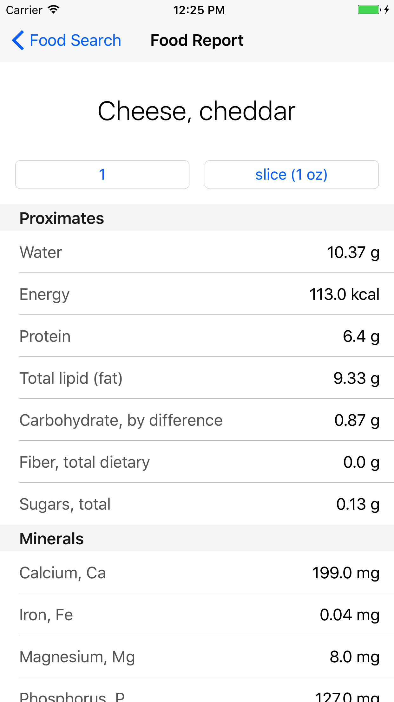

[](https://github.com/Carthage/Carthage)

# NutrientKit

Search over 200,000 food and nutrient reports provided by the USDA.

| Food Search | Food Reports |
|-------------|--------------|
|||

## Usage

NutrientKit (`NutrientKit.framework`) integrates with the [USDA National Nutrient Database for Standard Reference](https://www.ars.usda.gov/northeast-area/beltsville-md/beltsville-human-nutrition-research-center/nutrient-data-laboratory/docs/usda-national-nutrient-database-for-standard-reference/) via the [USDA NDB API](https://ndb.nal.usda.gov/ndb/doc/index). Food composition data is in the public domain, there is no copyright and no permission is needed for its use.

To use NutrientKit in your app, you'll need to [sign up for a Data.gov API key](https://api.data.gov/signup/). 

### Nutrient Store

First, create a NutrientStore with your API key:

`let nutrientStore = NutrientStore(apiKey: "YOUR_API_KEY")`

### Search

A search request sends keyword queries and returns lists of foods which contain one or more of
     the keywords in the food description, scientific name, or commerical name fields.
     
```
let query = "Cheddar cheese"
    
nutrientStore.search(withQuery: query, dataSource: . standardReference) { page, error in
	// Reload the list of search items.
}
```
     
[NDB API Search Documentation](https://ndb.nal.usda.gov/ndb/doc/apilist/API-SEARCH.md)

### Food Reports

A food report is a list of nutrients and their values in various portions for a specific food. 

```
let ndbno = "01009" // Cheese, cheddar

nutrientStore.basicReport(forNDBno: ndbno) { report, error in
    // Present the food report.
}
```

[NDB API Food Report V2 Documentation](https://ndb.nal.usda.gov/ndb/doc/apilist/API-FOOD-REPORTV2.md)

## Example

A simple example project is provided in the `NutrientKitExample` directory.


## Installation

Add:

`github "bfahey/NutrientKit"`

To your `Cartfile`.

## Acknowledgements

* US Department of Agriculture, Agricultural Research Service, Nutrient Data Laboratory. USDA National Nutrient Database for Standard Reference, Release 28. Version Current: September 2015, slightly revised May 2016. [Nutrient Data Laboratory Home Page](http://www.ars.usda.gov/nutrientdata)

* U.S. Department of Agriculture, Agricultural Research Service. USDA Branded Food Products Database. [Nutrient Data Laboratory Home Page](http://ndb.nal.usda.gov)
